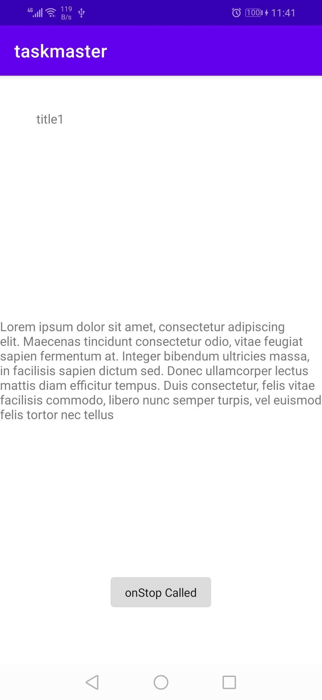
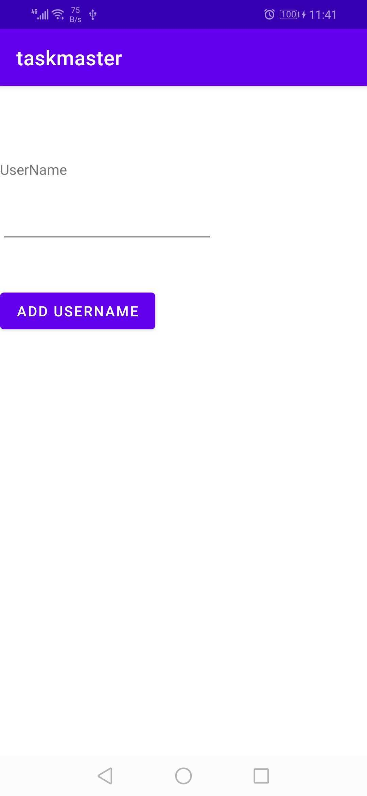
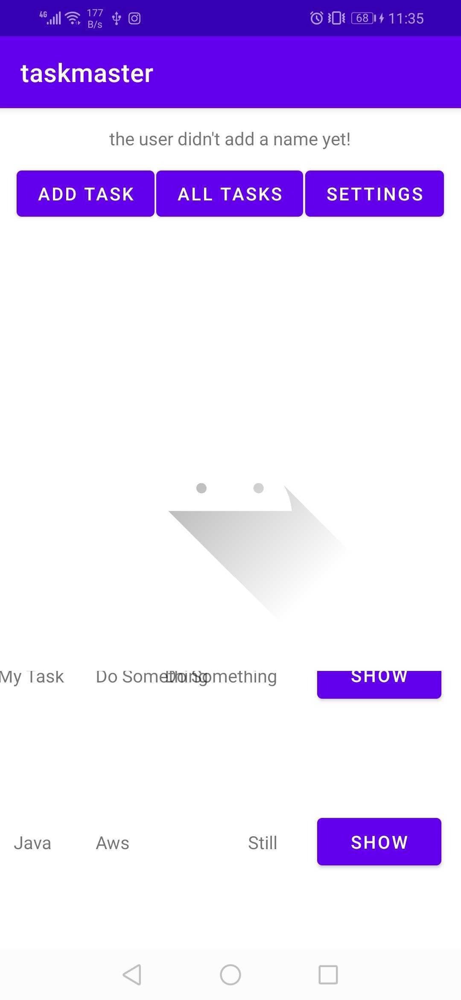
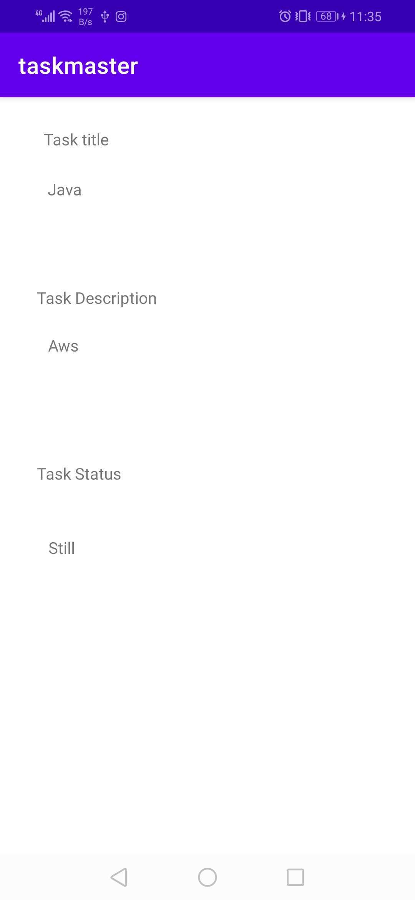
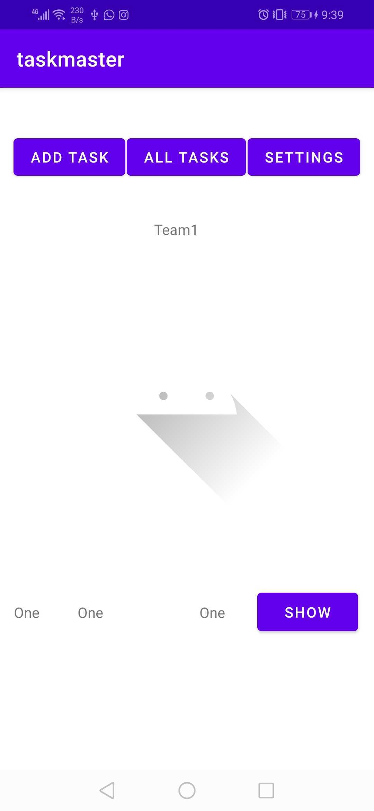
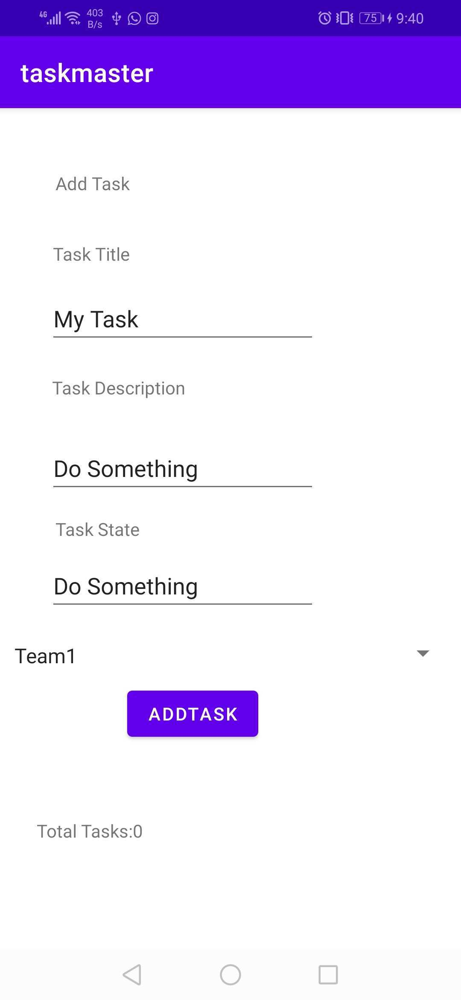
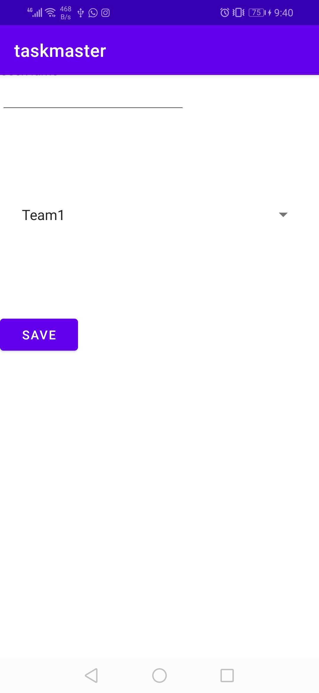
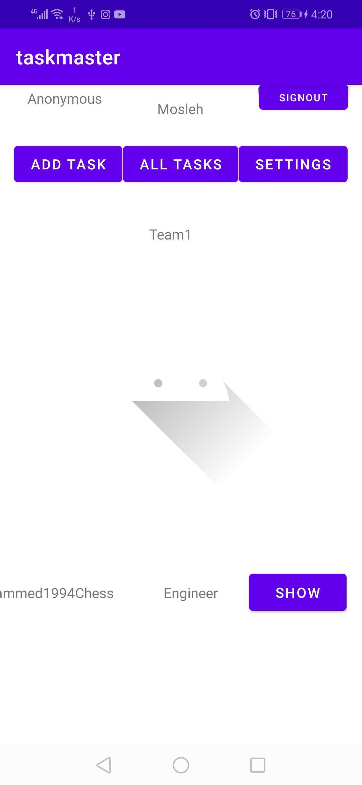
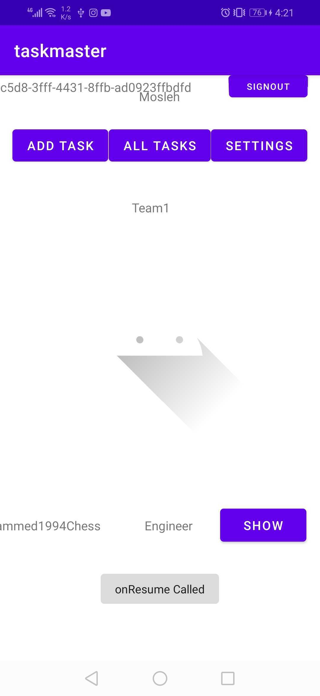

# taskmaster
 
*taskmaster Android application helps organize daily life by adding tasks .

* taskmaster contains these avtivites :
1. Home :

   - Refactor your homepage to use a RecyclerView for displaying Task data. This should have hardcoded Task data for now.
   - Create a TaskAdapter class that displays data from a list of Tasks.
   - In your MainActivity, create at least three hardcoded Task instances and use those to populate your RecyclerView/ViewAdapter.
   
2. Addtask:

   - that contains 2 input one for title of task and other for description of task

3. Alltasks:

   - Disply all tasks

4. Settings

   - User can add username that display in Home page

   

5. Taskdetail
   
   - Contain Tile and description of task

## lab 32 :

- Update Main activity

- Update Taskdetail activity

## Lab 33: Related Data

- Create a second entity for a team, which has a name and a list of tasks. Update your tasks to be owned by a team.

- Add  Spinner for which team that task belongs to in Addtask activity.

- allow the user to choose their team on the Settings page.through spinner.

## lab 36: Cognito

- user login and sign up flows to the application, using Cognito’s pre-built UI as appropriate.

