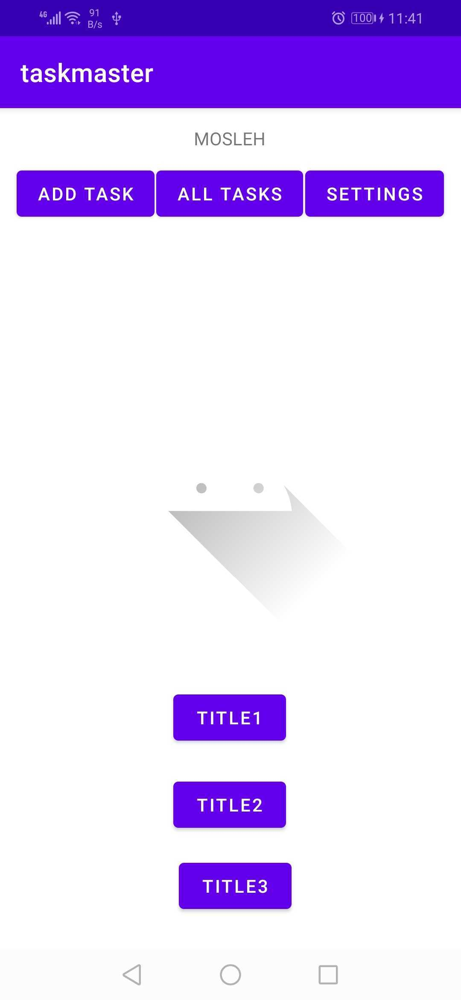

# taskmaster
 
*taskmaster Android application helps organize daily life by adding tasks .

* taskmaster contains these avtivites :
1. Home :

   - Contains 2 Buttons that links to another activites (Addtask,Alltasks)

2. Addtask:

   - that contains 2 input one for title of task and other for description of task

3. Alltasks:

   - Disply all tasks